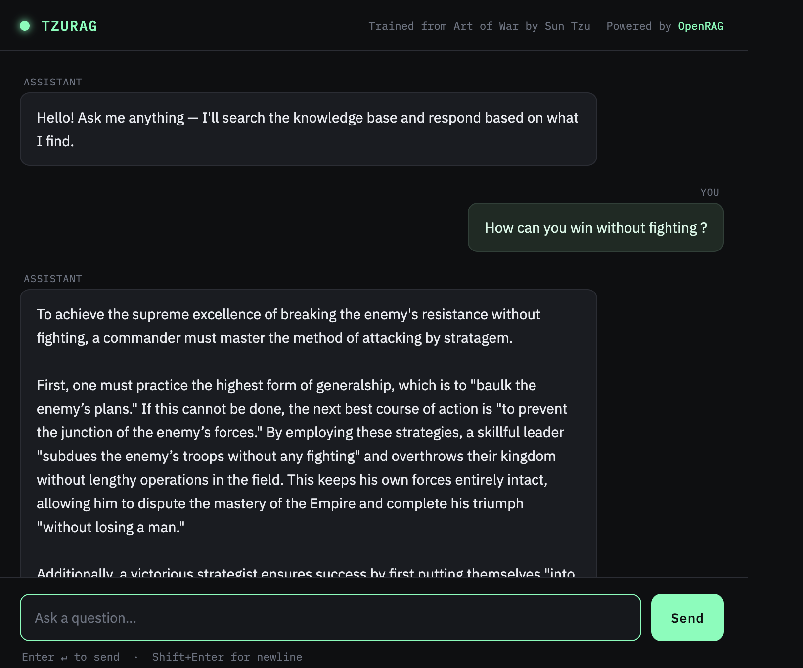

# OpenRAG



A lightweight, open-source Retrieval-Augmented Generation (RAG) library that you can drop your own documents into and get a fully working Q&A app — with a browser UI and a REST API — out of the box.

Built on local [all-MiniLM-L6-v2](https://huggingface.co/sentence-transformers/all-MiniLM-L6-v2) embeddings, hybrid retrieval with BM25 + vector search, cross-encoder reranking, and Google Gemini for generation.

No cloud embedding costs. No vendor lock-in for vector search. Just your documents, locally indexed, intelligently queried.

---

## Features

- **Multi-format ingestion** — supports `.txt` and `.pdf` source documents
- **Local embeddings** — uses `all-MiniLM-L6-v2`, runs entirely on your machine
- **Hybrid retrieval** — combines dense vector search and BM25 keyword search, fused with Reciprocal Rank Fusion (RRF)
- **Cross-encoder reranking** — `ms-marco-MiniLM-L-6-v2` reranks candidates for higher precision before sending to the LLM
- **Persistent vector store** — embeddings saved to disk via ChromaDB, no re-processing on restart
- **Gemini-powered answers** — Google Gemini generates responses grounded strictly in retrieved chunks
- **Browser UI** — reactive chat interface, no page reloads
- **REST API** — query your RAG programmatically via `POST /ask`
- **Plug and play** — configure the app name, source material, and system prompt via a single `config.ini` file

---

## Getting Started

### 1. Clone the repository

```bash
git clone https://github.com/AryvLabs/OpenRAG.git
cd OpenRAG
```

### 2. Install dependencies

For ingestion (first-time setup):
```bash
pip install -r requirements-train.txt
```

For running the app only (after embeddings are generated):
```bash
pip install -r requirements.txt
```

### 3. Configure your RAG instance

Edit `config.ini` in the project root to set your app name, source material label, and system prompt:

```ini
[rag]
name = TestRAG
source = Wuthering Heights by Emily Brontë

[prompt]
system = You are a literary expert. Your sole purpose is to answer questions strictly using the text provided in the reference passage...
```

The `name` and `source` fields appear in the browser UI header and API responses. The `system` prompt controls how the LLM behaves — change it to suit your domain.

### 4. Add your source documents

Place your `corpus.txt` or `corpus.pdf` into the `src/corpus/` directory.

### 5. Generate embeddings

Run `embed.py` from the `src/` directory:

```bash
# For plain text
cd src
python3 embed.py txt

# For PDF
cd src
python3 embed.py pdf
```

This populates `src/db/` with vector data. Re-run whenever you update the corpus.

### 6. Set your Gemini API key

```bash
# macOS / Linux
export GEMINI_API_KEY="your_gemini_api_key_here"

# Windows (Command Prompt)
set GEMINI_API_KEY=your_gemini_api_key_here

# Windows (PowerShell)
$env:GEMINI_API_KEY="your_gemini_api_key_here"
```

Get your key at [Google AI Studio](https://aistudio.google.com/app/apikey).

### 7. Start the app

```bash
python3 app.py
```

Open `http://localhost:5000` for the UI, or use the API directly.

---

## API Reference

### POST /ask

Run a RAG query programmatically.

**Request**
```json
{
  "query": "Who is Heathcliff?"
}
```

**Response**
```json
{
  "answer": "Heathcliff is a foundling taken in by Mr Earnshaw...",
  "rag": "TestRAG",
  "source": "Wuthering Heights by Emily Brontë"
}
```

**Error response**
```json
{
  "error": "Missing or empty 'query' field."
}
```

### GET /health

Liveness check. Useful for cloud platform health check configuration.

```json
{
  "status": "ok",
  "rag": "TestRAG",
  "source": "Wuthering Heights by Emily Brontë"
}
```

---

## Retrieval Pipeline

```
query
  ├── dense vector search (all-MiniLM-L6-v2)  ─┐
  └── BM25 keyword search                      ─┴─ RRF fusion → cross-encoder rerank → top-k chunks → Gemini
```

1. The query is embedded with the same model used at ingestion time and compared against stored vectors in ChromaDB.
2. BM25 scores the same query against the full corpus stored in ChromaDB.
3. Both ranked lists are merged using Reciprocal Rank Fusion.
4. A cross-encoder (`ms-marco-MiniLM-L-6-v2`) reranks the fused candidates by jointly scoring each `(query, document)` pair.
5. The top chunks are passed to Gemini with the system prompt from `config.ini`.

---

## Deploying to the Cloud

Use `requirements.txt` for deployment — it excludes the training-only dependencies since embeddings are already stored in ChromaDB.

```bash
pip install -r requirements.txt
gunicorn app:app
```

Set `GEMINI_API_KEY` as an environment variable in your cloud platform's settings. For Render, configure `GET /health` as the health check endpoint.

---

## Configuration Reference

| File | Key | Description |
|---|---|---|
| `config.ini` | `rag.name` | Display name shown in the UI and API responses |
| `config.ini` | `rag.source` | Source material label shown in the UI and API responses |
| `config.ini` | `prompt.system` | System prompt sent to the LLM on every query |
| Environment | `GEMINI_API_KEY` | Google Gemini API key (required) |

---

## Contributing

Contributions are welcome. Feel free to open PRs with bug fixes and feature suggestions.

Found a bug or have a feature request? [Open an issue](https://github.com/AryvLabs//OpenRAG/issues) and include:
- A clear description of the problem or suggestion
- Steps to reproduce (for bugs)
- Your environment details (OS, Python version)

### Roadmap
- Support for other LLMs
- Streaming API responses
- Reranker model configurability via `config.ini`

---

## For Enterprise

If you're looking to build a RAG or other AI feature for your enterprise, check us out [here](https://aryvlabs.com). Our team can help you build your next AI workflow.
